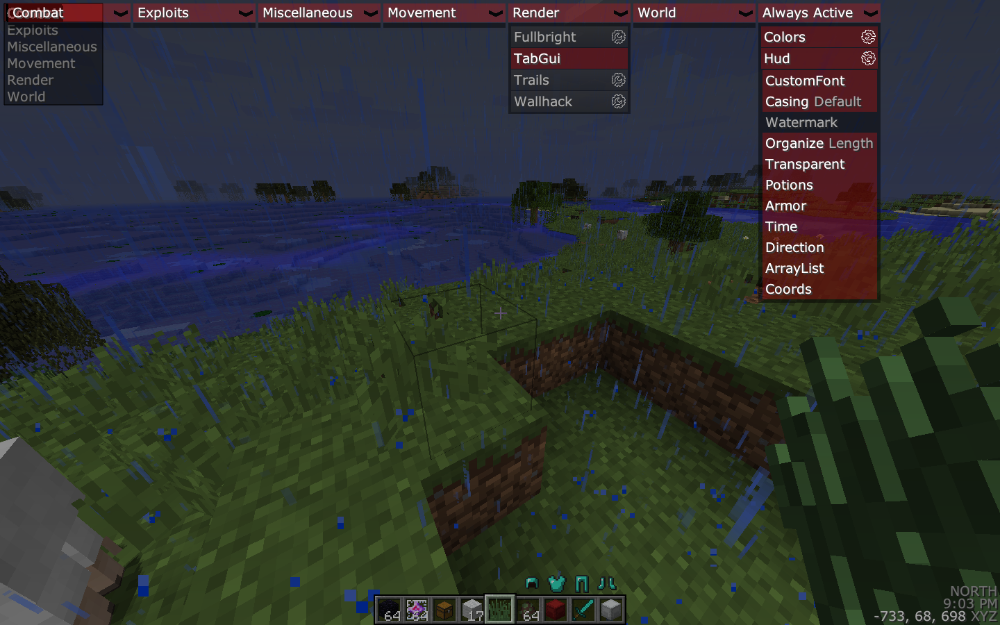

# Exeter-1.12.2

Exeter client. A client created by Friendly,
for Minecraft version 1.8. It has been released
or leaked on that version. I have obtained
that version, and here, has reconstructed the
original source code. In this process, I have
also ported the client to my preferred version
and platform, Minecraft 1.12.2 forge. Furthermore,
I have done work to clean up the decompiled code,
and javadoc it.

(yes, I reskined it to be like future)
The original exeter looked slightly different, but I did this for fun, since the gui code is the exact same as Future.

Exeter is most widely known for being the client the 0x22 based Future client off of.
To this day, Future is still based on Exeter's base. (0x22 has even admitted this). Furthermore, 0x has hardly changed the Future base at all, so this source code should be nearly identical to a very, very stripped down version of Future.

Event system: The event system in exeter is a bit different from usual clients. It works the same way that 3arthhack's does (and Future's does).
